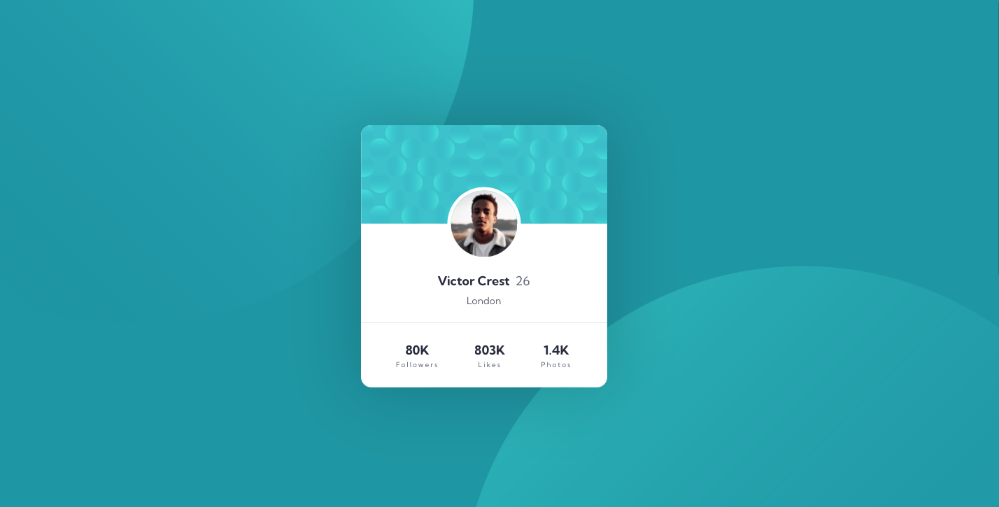

# Frontend Mentor - Profile card component

This is a solution to the [Profile card component challenge on Frontend Mentor](https://www.frontendmentor.io/challenges/profile-card-component-cfArpWshJ). Frontend Mentor challenges help you improve your coding skills by building realistic projects.

## Table of contents

- [Overview](#overview)
  - [Screenshot](#screenshot)
  - [Links](#links)
- [My process](#my-process)
  - [Built with](#built-with)
  - [What I learned](#what-i-learned)
  - [Continued development](#continued-development)
  - [Useful resources](#useful-resources)
- [Author](#author)

## Overview

### Screenshot

### Links

- Solution URL: [Add solution URL here](https://your-solution-url.com)
- Live Site URL: (https://jessica-sand.github.io)

## My process

### Built with

- Semantic HTML5 markup
- CSS custom properties

### What I learned

I learned how to center the elements in the middle of the screen something that I never know to do.
And I learned how to do pixel perfect, I hope so.

### Continued development

I would like to improve my css knowledge to avoid wasting time in research just to style simple things.

### Useful resources

- [Resource 1](https://www.joshwcomeau.com/css/custom-css-reset/) - I wanted to use a reset style different from the one I use to use.
- [Resource 2](https://www.joshwcomeau.com/css/pixel-perfection/) - This is an amazing article which helped me finally to understand how to be pixel perfect.

## Author

- Frontend Mentor - [@Jessica-Sand](https://www.frontendmentor.io/profile/Jessica-Sand)
- Github - (https://github.com/Jessica-Sand)
